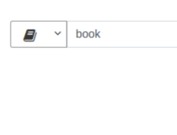
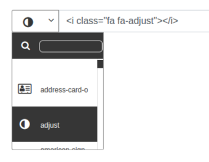

Awesome4-iconpicker
=============
一個簡單的(Font Awesome 4 Icon)選擇器擴充包, 基於Bootstrap Layout<br>
A sample iconpicker packeages for Font Awesome 4 Icon and Bootstrap Layout.<br>

# Start
> `npm install awesome4-iconpicker`
# Use before
> 你必須先引入五個主要檔案<br />
> You have to include four file.
*   Bootstrap CSS
*   font-awesome-4.7.0.min.css
*   awesome4-iconpicker.min.css (from dist folder)
*   JQuery
*   awesome4-iconpicker.min.js (from dist folder)
> The packeage provide font-awesome-4.7.0.min file.
```html
<link rel="stylesheet" href="https://maxcdn.bootstrapcdn.com/bootstrap/4.0.0/css/bootstrap.min.css" >
<link rel="stylesheet" href="font-awesome-4.7.0/css/font-awesome.min.css">
<link rel="stylesheet" href="dist/awesome4-iconpicker.min.css">
<script src="https://code.jquery.com/jquery-3.2.1.slim.min.js"></script>
<script src="dist/awesome4-iconpicker.min.js"></script>
```
# Use
## base
>Your Html
```html
<div class="input-group">
    <input type="text" class="form-control demo">
</div>
```
>Your Js
```javascript
$('.demo').iconpicker();
```
## selected
>  Your Html tag add " data-iconname='iconname' " <br />
```html
<div class="input-group">
    <input type="text" class="form-control demo" data-iconname='book'>
</div>
```
>  Your Js <br />
```javascript
    $('.demo').iconpicker();
```

## outputType
> Your Html <br />
```html
<div class="input-group">
    <input type="text" class="form-control demo">
</div>
```
>  Your Js <br />
```javascript
    $('.demo').iconpicker( {  outputType : 'icon-name'  } );
    $('.demo').iconpicker( {  outputType : 'html'  } );
```


